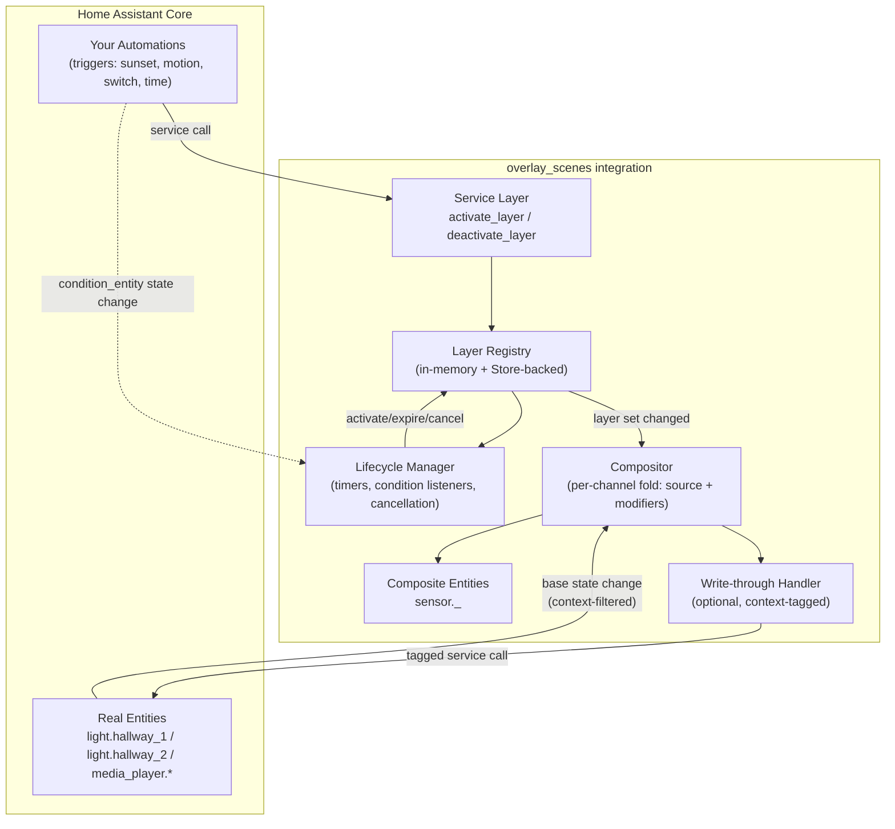
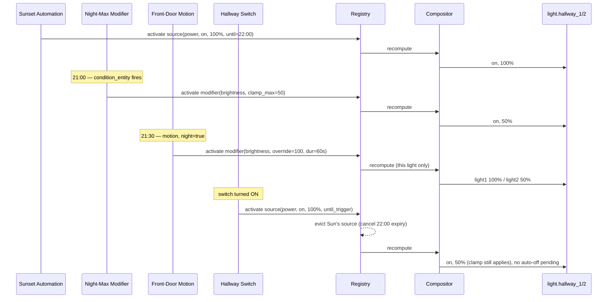

# Overlay Scenes — High-Level Architecture

`custom_components/overlay_scenes/`, delivered via HACS, single integration, no add-on.

## Component diagram

## Core internal model

**Channel** = one attribute of one target entity (e.g. `light.hallway_1.brightness`). The unit the compositor actually resolves.

**Layer**, two roles:
- **Source** — asserts state, has its own lifetime, and **evicts** whatever source currently occupies a channel on activation (kills the old layer's timer, doesn't just outrank it)
- **Modifier** — folds on top of the channel's current value using an op (`or`, `and`, `clamp_min`, `clamp_max`, `override`, `xor`, …); never evicts anything, just expires

Resolution order per channel, per recompute: `source.value → fold(modifiers sorted by priority ascending)`.

## Module breakdown

| File | Responsibility |
|---|---|
| `config_flow.py` | UI/YAML for defining Overlay Sets and Layers |
| `layer.py` | `Layer` dataclass, `SourceLayer`/`ModifierLayer`, op definitions per value type |
| `registry.py` | Active-layer bookkeeping per channel, eviction logic on source activation |
| `lifecycle.py` | Duration timers, `while_condition` entity listeners, `until_trigger` bookkeeping |
| `compositor.py` | Pure fold function: `(base_state, active_layers) -> composite_value` |
| `store.py` | Persists active layer state to `.storage/overlay_scenes.layers`, restores on restart |
| `entity.py` | Composite `sensor.*` entities, layer-status `sensor.*` entities |
| `services.yaml` + `__init__.py` | `activate_layer`, `deactivate_layer` service registration |
| `writethrough.py` | Optional: tags own service calls with `context.id`, filters them out of base-state listening to avoid feedback loops |

## Sequence: your 9:30pm walkthrough

## Modifier ops — clarified

Any op is fair game for a modifier, including forcing false/off (`and(false)`, `override(false)`) — e.g. "mute all speakers while on a call". The source/modifier split is about **lifetime-cancellation only**, not about which values are reachable:

- **Source**: has its own independent lifetime; activating a new source **evicts** the previous source occupying the same channel, cancelling its pending expiry.
- **Modifier**: never evicts anything. It only ever changes what the fold computes; when its own lifetime ends it stops contributing and whatever's underneath reasserts itself untouched.

The eviction mechanic is unique to sources because they're the only layers with independent lifetimes that could conflict. There is no scenario where a modifier needs to "win" by killing another layer's timer — that's what priority + folding already handles.

## UI plan

**Tier 1 (build first):** `config_flow.py` + config subentries. Pure Python, no frontend build, native HA look for free. Covers creating Overlay Sets and Layers.

**Tier 2 (later, only once compositor/service contract is stable):** custom Lovelace card (`lit-element` + TypeScript) for live status — priority stack, active layers, current composite values. Stick to the documented custom-card contract (`setConfig`, `hass` property, `config-changed`, HA CSS custom properties) rather than undocumented `hui-*` internals, to keep this low-maintenance across HA frontend releases. Bundle the card so the integration self-registers it as a lovelace resource on setup — single HACS install, not two.

**Tier 3 (skip):** dedicated custom panel/sidebar app. Disproportionate effort for what this needs; a card covers it.

## Diagnostic logging

Timing/ordering bugs are the main failure mode here, so logging needs to be structured from day one, not bolted on:

- Every compositor recompute logged as a record: channel, triggering event, active layer set (id + priority + role), input values, resolved output — queryable in the HA logbook, not prose.
- **Evictions logged explicitly and separately** from normal recomputes — "source X evicted source Y, cancelling Y's 22:00 expiry" is the line you'll need most when debugging a "why didn't it turn off" report.
- Lifecycle transitions (activate/expire/cancel/refresh) logged with reason: `duration_elapsed`, `condition_false`, `evicted_by:<layer_id>`, `service_call`.
- Standard HA `_LOGGER.debug` per module, toggled via `logger:` config — silent by default.
- Consider a diagnostic attribute on each composite `sensor.*` entity showing current occupant + full active layer stack. Gets most of Tier 2's monitoring value for free, in plain entity state, before any card exists.

## Output mode — decided: write-through

Write-through (compositor calls `light.turn_on` / `media_player.volume_set` etc. directly on real targets), not composite-only.

**Why:** every scenario in this project ends with "the light/speaker does the thing" — there's no downstream automation meant to read a composite sensor and act on it. Composite-only would just relocate the write-through logic into a second layer someone has to build and maintain anyway, with no offsetting benefit.

**Scope of the decision:** per Overlay Set (all channels in a set write-through the same way), not per layer. Matches every scenario so far; revisit only if a concrete case needs mixed behavior within one set.

**Implementation requirement this creates:** the compositor's own writes will re-trigger the base-state listener unless filtered. HA tags every state change with a `context` (`id` + `parent_id`). Capture the `context.id` returned from each service call the compositor makes, and in the base-state listener discard any incoming state change whose context matches one just issued — otherwise it gets misread as a new source layer, causing recompute loops or a clamp that silently becomes permanent (the volume-restore failure mode).

## Layer authoring — decided: form-based (via Tier 1)

Config subentries, not YAML — this follows directly from the Tier 1 decision, since subentries are inherently form/schema-driven. The one consequence worth flagging: `value` fields that need templates (e.g. "clamp to `input_number.night_volume`") will need a template-capable form field (selector, not a plain string) rather than free-form YAML — check `config_flow` selector support covers this before building the schema.

Layer authoring uses two native flow steps. The first selects the layer identity,
role, and target entities. The second presents an attribute picker containing
`state` plus only attributes currently shared by every selected entity, followed
by the layer behavior fields.

Automation actions use native pickers: Overlay Set actions select a config
entry and layer actions select a layer-status entity. Layer-status entity names
include the Overlay Set name so similarly named layers remain distinguishable.

## Eviction scope — decided: same channel only

A new source evicts the previous source on the *same channel* only, not every channel the old source happened to target. A layer targets exactly one attribute, though it may target that attribute on several entities. Eviction is evaluated independently per entity channel, so the registry's exclusivity bookkeeping is keyed at channel granularity, not layer granularity.

**Consequence worth designing for:** a multi-entity source can end up partially evicted — one entity's channel replaced by a newer source while another channel it still holds keeps running on its original timer. That's the correct behavior given this decision (each channel resolves independently), but it means the registry can't treat "a source" as a single atomic unit for lifecycle purposes — it needs to track per-channel occupancy even when several entity channels were originally activated together as one source layer.
